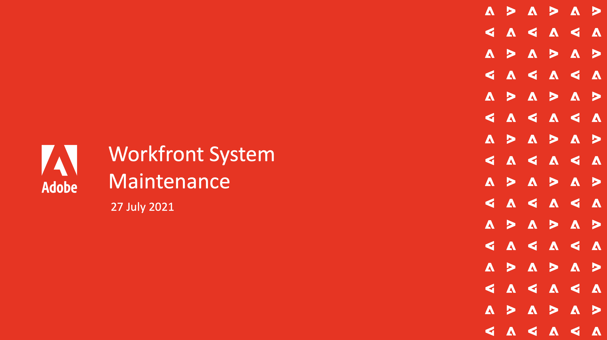
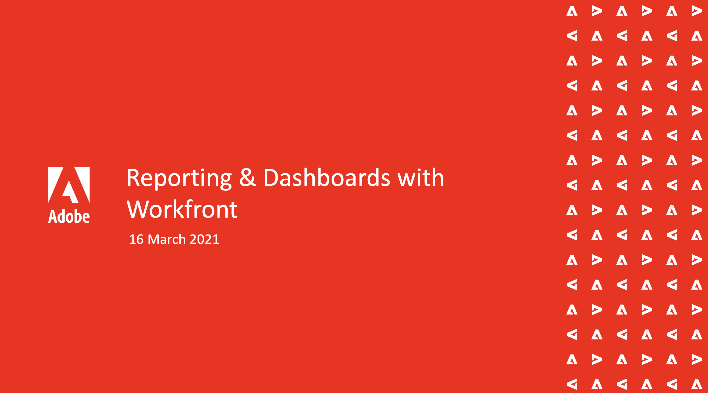
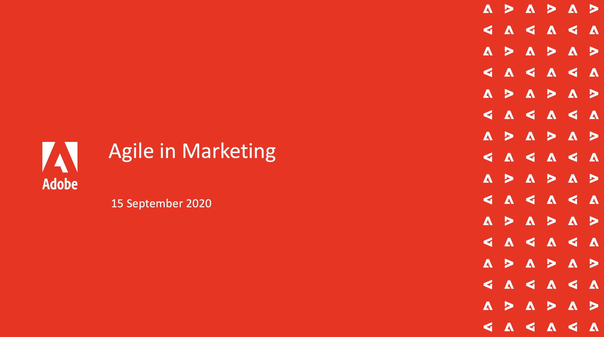

# Adobe Workfront Events {#overview}

Whether you're just getting started or a veteran user, you can always use more tips, tricks and practical how to's. 

Here at Adobe Workfront Events you can browse our video library to see what experts and peers have shared about Workfront. Dive into what they have done to enhance their and their user's experience.

>[!TIP]
>
>**All recorded sessions are listed in the navigation on the left**.

## Featured Sessions

<table>
  <tr>
   <td>
      
      

         <a href="/help/events/analytics/jun2021/getting-started.md"><strong>Workfront System Maintenance</strong></a>
<!----          <em>foo</em> --->
      

      

         
         Watch as a panel of system administrators discuss things to consider when it comes to system setup, regular maintenance, and clean-up.
      

    </td>
   <td>
      
      

         <a href="/help/events/user-groups/reporting-and-dashboards.md"><strong>Reporting & Dashboards</strong></a>
<!----          <em>foo</em> --->
      

      

         
         See reports and dashboards others have created and setup for their organizations and what best practices they’ve learned along the way.
      

    </td>
   <td>
      
      

         <a href="/help/events/workfront/apr2022/ten-tips.md"><strong>Agile in Marketing</strong></a>
<!----          <em>foo</em> --->
      

      

         
         Listen to Agile experts talk and discuss the high points and trends they’ve seen with agile, general agility in business, and how several experts use Workfront for agile.
      

    </td>
  </tr>
</table>