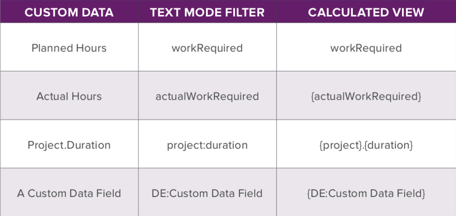

# Ask the Expert - Supercharge Basic Text Mode Reporting using the API Explorer

Learn about the API explorer, how to use it, and how to enhance your reports leveraging basic text mode. This webinar was recorded on January 22, 2020.

>[!VIDEO](https://video.tv.adobe.com/v/341124/?quality=12)

## Additional Resources




**Final “All Job Roles” column**

```
description="Primary =" indicates the user's primary job role
displayname=All Job Roles
listdelimiter=<p>
listmethod=nested(userRoles).lists
textmode=true
type=iterate
valueexpression=IF({user}.{roleID}={role}.{ID},CONCAT("Primary = ",{role}.{name}),{role}.{name})
valueformat=HTML
```

**Text Mode for “All Teams” column**

```
displayname=All Teams
listdelimiter=<p>
listmethod=nested(teams).lists
textmode=true
type=iterate
valueexpression={name}
valueformat=HTML
```

**Text Mode for “All Groups” column**

```
displayname=All Groups
listdelimiter=<p>
listmethod=nested(userGroups).lists
textmode=true
type=iterate
valuefield=group:name
valueformat=HTML
```

**Text Mode for “Direct Reports” column**

```
displayname=Direct Reports
listdelimiter=<p>
listmethod=nested(directReports).lists
textmode=true
type=iterate
valueexpression={name}
valueformat=HTML
```

## Q&A

**Question**

Is it possible to use any collection in a report, using text mode?

**Answer**

Yes, you can use any object in the collections area. You'll want to explore and see what you have access to. Not everything will have access to both the user object and the job role object like we saw with the User Roles object in the API explorer.

**Question**

Can you discuss “conditional use of different collections in same column (project updates vs task updates)”

**Answer**

When you're in the iteration area and you see the valuefield or valueexpression there, that's acessing one of the items in your collection list. Using the valuefield we can get the name of that job role, for instance, or anything that is in that item in the list. If you are in a task, a task object can reference the project that it's in.

**Question**

Can you discuss if the “task updates collection is only possible in a task report?”

**Answer**

When you're creating an issue report you can see task information if the issue was reported against the task, and you would also be able to see that information from within the collection. Except for those situations you would need to be in a task report to see task collection data.

**Question**

Can you share Text format ([!DNL CSS]) examples?

**Answer**

Workfront does not support [!DNL CSS] in text mode.

**Question**

What is the best and or quickest way to locate a custom field name - for text mode reporting? I have used the HTML edit option in the browser OR by adding a field in a report and switching to text mode to grab it BUT... curious how others perform this

**Answer**

I find it quickest to select the field in the UI then switch to Text Mode and copy the field name. This ensures that I get the correct spelling for the field.

**Question**

How can I use text mode to identify members of a team in a report? We currently use teams assignments in task approval workflows and would like to list the team members in the current approval stage in a column similar to how the Approvers and Status field works.

**Answer**

In order to reference the Team Members associated with the current approval stage, you would need to reference a collection of a referenced collection, which is not currently possible through Workfront's text mode capabilities. The column that your organization is currently using that shows the Team associated with the approval is your best option.

**Question**

Does the field and object name have to be Proper Case (ex. role vs Role)?

**Answer**

When you reference objects in text mode, you will want to write it exactly as the right hand column of the API Explorer shows. For example, if you want to reference a Project name from a Task report, your valuefield would look like the following: 

```
valuefield=project:name
```

However, in the case of Issues, those are called opTasks in the API Explorer. So if you were to run an Hour report and want to add a column for Issue name, the valuefield would
look like the following: 

```
valuefield=opTask:name
```

**Question**

I'm looking to build a report that shows for each project, the current active task(s) being worked on. How would I best do that? I imagine it would be a task report that also has Project info columns added?

**Answer**

That is correct. A task report would be best for this. You would need to define "Active Tasks". If you are using predecessors then this would be tasks that are Ready. So you can filter by Ready = True. This would bring in any tasks that are Ready to start. Then I would recommend that you group by Project Name, this way your tasks are all grouped together and you can see at a glance which tasks belong to which Project.

**Question**

Is there a way to create reports that calculate data - for example, % of projects that meet certain criteria?

**Answer**

The best way to create a report to present or calculate data (% for example) would be to apply groupings to your report and then apply a chart. If you were to add a pie chart to your report, you have the option for the pie slices to be in values or percentages.

**Question**

Can you use text mode to identify the members of a team that are assigned to current task approval stage similar to Approvers and Status column?

**Answer**

You would need to add a collection column in text mode to your Task report with the following:

```
displayname=Current Approval Stage Approvers 
listdelimiter=<p> 
listmethod=nested(currentApprovalStep.stepApprovers).lists 
textmode=true
type=iterate 
valuefield=user:name 
valueformat=HTML
```

**Question**

Are you able to filter where All Groups contain a particular Group?

**Answer**

If you want to filter the items in your report you would do it under the filter tab of your report. So if you wanted see only users where one of their groups was Accounting, you would add a filter rule that said:

```
Other Groups>ID>Equal>Accounting
```

**Question**

Is there a way to create a report that determines the actual duration of a combination of tasks?

**Answer**

You would need to filter your report to only include the combination of tasks you want. Then you would need to put an Actual Duration column in your view and summarize it by Sum in the Column Settings, and lastly you would need to group your report in some way. When you run the report the grouping bar will show the total of the actual durations contained in the rows being grouped.

**Question**

Is there a way to subtract out tasks that fall under a parent to determine the duration for the rest of the tasks under a parent?

**Answer**

The duration of a parent task is calculated by subtracting the start date of the earliest starting task from the end date of the latest ending task under that parent. In a report you only know about each indiviual task that comes under consideration whether or not to display. The report engine has no way to hang on to information from one task and use it when looking at another task. So the only way to accomplish what you're asking is to remove a task from being under a certain parent while in the project task list and observe how the duration of the parent task recalculates.

**Question**

For conditional groupings, a custom form (think "Western States", "Central States", "Eastern States") to decode the individual groups is a common technique that works well on that note, when do you recommend using calculated groupings vs calculated parameters?

**Answer**

Calculated groupings (aka a valueexpression in a grouping) is a convenient way to get a result to show in your grouping bar. This can also be done using a calculated custom field. There are pros and cons for each approach, which are:

* Valueexpressions are calculated each time your browser page is refreshed. This can be better than calculated custom fields which are recalculated whenever the object they're attached to is edited, or when the calculated fields are recalculated in a bulk edit, or when the custom form is edited and the ‘Update previous calculations’ option is selected.
* However, valueexpressions cannot be used in charts, conditional formatting or filter. You will need to use calculated custom fields for these.

**Question**

Is there no way to change the grouping display name from "No Value" to anything else we choose to call it for reporting purposes? in other words, it will ALWAYS be "No Value"?

**Answer**

There is a way to replace "No Value" with something different. Suppose you have a project report grouped by Portfolio Name. All the projects that are not assigned to a portfolio will end up in a grouping with the title:

```
Portfolio: Name: No Value
```

To change this, edit the grouping in text mode and replace this line:

```
group.0.valuefield=portfolio:name
```

with this line:

```
group.0.valueexpression=IF(ISBLANK({portfolio}.{name}),"Not in any Portfolio",{portfolio}.{name})
```

The grouping will now have this title:

```
Portfolio: Name: Not in any Portfolio
```

**Question**

Is there a parameter to track incomplete assignments i.e: 

1. Tasks with a single assignment that didn't get an individual assigned to it or 
1. Tasks with multiple assignments that have at least one unassigned individual for the requested roles

**Answer**

This could be accomplished by using an Assignment Report and filtering for 

```
Assigned To ID > Is Blank and Role ID > Is Not Blank
```

This will pull in all tasks or issues that have been assigned to a role, but not necessarily a specific user. You will need to add the columns for Task and Issue name to see which object the assignment belongs to, and if grouped by Project name it should help to keep it organized.

**Question**

Chuck, I'm forgetting, but do you recall the property in textmode that will then render as a tooltip, on hover?

**Answer**

description= allows you to display a tooltip when hovering over the column header.

**Question**

Can I report on a checkbox field that allows multiple selections, but only pull the first selection into the report?

**Answer**

Yes. The selected choices in the checkbox field are all in one string with each selection separated by a comma. You will use the SEARCH expression to find the position of the first comma in the Checkbox Field, then use that index with the LEFT expression to display that many characters from the beginning of the list. Here's the code: 

```
valueexpression=IF(SEARCH(",",{DE:Checkbox Field},0)>0,LEFT({DE:Checkbox Field},SEARCH(",",{DE:Checkbox Field},0)),{DE:Checkbox Field})
```

If you use a comma in a selection name in your checkbox field it will only display the part of that selection up to the first comma.
